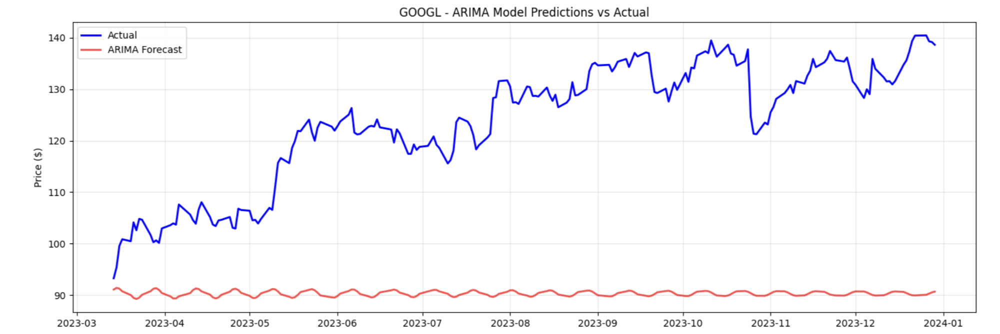
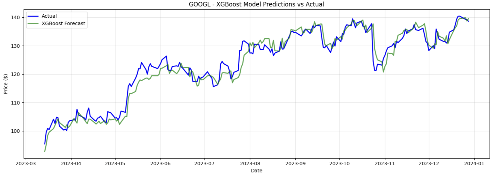

# Stock Price Prediction & Trading Strategy Evaluation

**Author:** Aditya Shrotriya  
**Role:** Data Science Intern
**Tech Stack:** Python, Pandas, NumPy, Statsmodels, XGBoost, Matplotlib  

---

## 📌 Project Overview

This repository contains an end-to-end data science pipeline developed as part of
the internship assignment for **Invsto**.

The goal of the project is to:
- Analyze historical equity market data
- Build predictive models for stock prices
- Compare classical time-series models with machine learning approaches
- Evaluate whether predictive accuracy translates into trading profitability

The project is designed with a **hedge-fund research mindset**, focusing on
robust evaluation, time-series correctness, and portfolio-level insights.

---

## 📊 Dataset

- **Source:** Yahoo Finance (via `yfinance`)
- **Assets:** AAPL, MSFT, GOOGL, AMZN, NVDA
- **Frequency:** Daily OHLCV
- **Period:** January 2020 – January 2024

This period includes multiple market regimes such as the COVID crash,
post-pandemic rally, and interest-rate tightening cycles.

---

## 🔬 Methodology

### 1. Data Preparation
- Forward-filling missing values
- Time-series indexing and chronological splitting
- Portfolio-based data handling

### 2. Exploratory Data Analysis (EDA)
- Return and volatility analysis
- Liquidity analysis using volume
- Seasonal decomposition for trend inspection
.png)
.png)
 

### 3. Feature Engineering
- Log returns
- Moving averages
- Volatility measures
- Momentum indicators (RSI)
- Lagged return features

### 4. Modeling
Two models are implemented and compared:

#### ARIMA
- Classical time-series forecasting model
- Parameters selected using grid search and AIC
- Serves as a statistical baseline



#### Gradient Boosting (XGBoost)
- Captures non-linear relationships
- Uses engineered technical indicators
- Evaluated on out-of-sample data



### 5. Evaluation
- RMSE, MAE, and MAPE for prediction accuracy
- Strategy-level backtesting
- Buy-and-hold benchmark comparison
- Portfolio-level aggregation


---

## 📈 Key Findings

- XGBoost generally outperforms ARIMA in terms of prediction accuracy
- ARIMA remains competitive for stocks with strong trend persistence
- Predictive accuracy does not always translate directly into higher returns
- Portfolio-level evaluation provides more stable insights than single-stock analysis

---

## 🗂 Repository Structure

├── notebooks/        # Main analysis notebook

├── src/              # Modular data processing & modeling code

├── screenshots/      # Output visualizations

├── requirements.txt

└── README.md

---

## 🚀 How to Run

```bash
pip install -r requirements.txt

Open the notebook:

jupyter notebook notebooks/Stock_Price_Prediction_Invsto.ipynb

```

## 📬 Contact

Aditya Shrotriya

B.Tech Computer Science

India

Linkedlin - https://www.linkedin.com/in/aditya-shrotriya-95016a179/
